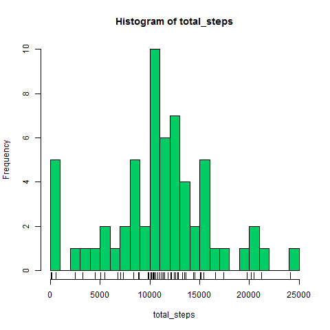
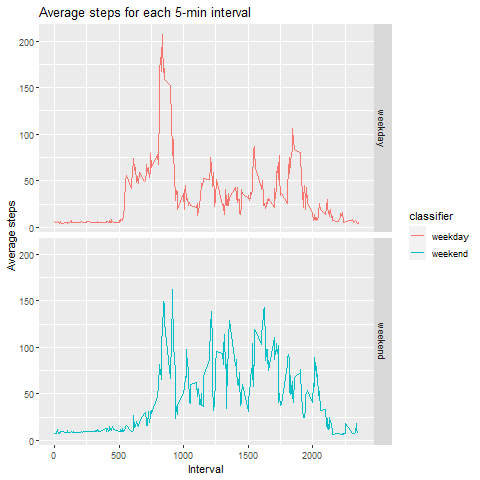

```{r setup, include=FALSE}
knitr::opts_chunk$set(echo = TRUE)
```

This project project is to use R Markdown to allow any user to reproduce the current analysis workflow. The dataset *Activity monitoring data* will be used and the variables are the following:

- **steps**: Number of steps taking in a 5-minute interval
- **date**: The date in YYYY-MM-DD format
- **interval**: Identifier for the 5-minute interval

The first steps are to load the different libraries, to unzip the data file and load it in the data frame called **activity** in R. 
```{r}
library(dplyr)
library(ggplot2)
unzip(zipfile = "activity.zip")
activity <- read.csv("activity.csv", header = TRUE)
```
Here is a quick view of the data frame **activity**.
```{r}
head(activity)
```
The data frame **activity** is composed as the following:
```{r}
str(activity)
```
The column *date* is a factor and needs to be changed to the class "Date".
```{r}
activity$date <- as.Date(as.character(activity$date, "%Y%m%d"))
```
The class of *date* has been succefully modified.
```{r}
str(activity)
```

## What is mean total number of steps taken per day?
The number of cumulative steps per day is obtained the following line of code:
```{r}
steps_count <- activity %>% group_by(date) %>% summarize(total_steps = sum(steps, na.rm = TRUE))
```

To generate a histogram of the *total number of steps* per day and save it in the PNG format:
```{r}
with(steps_count, hist(total_steps, breaks = 30, col = "springgreen3"))
rug(steps_count$total_steps)
```
<!-- -->
The *averaged number of steps* and *median number of steps* per day are given by
```{r}
steps_count_summary <- summary(steps_count$total_steps)
steps_count_summary
```
The average number of steps per day is `r as.integer(steps_count_summary[4])` and the median is `r as.integer(steps_count_summary[3])`.

## What is the average daily activity pattern?
To get the averaged number of steps per interval, run the following command:
```{r}
steps_mean_interval <- activity %>% group_by(interval) %>% summarize(mean_steps = mean(steps, na.rm = TRUE))
```

The plot of the time serie of the the averaged number of steps per 5-min interval is obtained using:
```{r}
with(steps_mean_interval, plot(x = interval, y = mean_steps, type = "l", col = "springgreen3", xlab = "Intervals", ylab = "Averaged steps"))
title("Averaged of steps per interval")
```
<!-- -->
The maximum averaged number of time can be obtained by
```{r}
max_mean_steps <- steps_mean_interval[which(steps_mean_interval$mean_steps == max(steps_mean_interval$mean_steps)), ]
max_mean_steps
```
and appears at the interval `r max_mean_steps[1]`.  

## Imputing missing values
Some intervals have missing values for the number of steps.  
```{r}
missing_values <- 100 * mean(is.na(activity$steps))
```
The missing values corresponds to `r missing_values`% of the dataset.

In order to alleviate the missing values, NAs are replaced by the average of their respective interval. The values from the data frame `steps_mean_interval` can be used for that purpose. First, a vector of the averaged number of steps per interval is adapted to the number of rows of the data frame **activity**.
```{r}
steps_mean_int_temp <- rep(steps_mean_interval$mean_steps, each = length(unique(activity$date)))
```
The index of the NAs in the data frame activity is collected and the NAs are replaced by the average of the number of step per interval.
```{r}
activity_new <- activity %>% arrange(date, interval)
idx <- which(is.na(activity_new$steps))
activity_new$steps[idx] = steps_mean_int_temp[idx]
str(activity_new)
```
The values of the total number of steps and the histogram are updated, as well as the mean and the median.
```{r}
steps_count <- activity_new %>% group_by(date) %>% summarize(total_steps = sum(steps, na.rm = TRUE))
with(steps_count, hist(total_steps, breaks = 30, col = "springgreen3"))
rug(steps_count$total_steps)
steps_count_summary <- summary(steps_count$total_steps)
steps_count_summary
```
<!-- -->
The updated average number of steps per day is `r as.integer(steps_count_summary[4])` and the updated median value is `r as.integer(steps_count_summary[3])`.  

The updated mean and median are higher compared to the first analysis. By imputing the missing values, the data frame may get closer to the true values.  

## Are there differences in activity patterns between weekdays and weekends?
Anew column days has been added to data frame **activity_new** which gives the days of the week when the steps have been recorded.
```{r}
activity_new <- activity_new %>% mutate(days = weekdays(date))
head(activity_new)
```
A new data frame with the each day of the week is classified by weekday or weekend has been created and used to annotate the data frame **activity_new**.
```{r}
days <- unique(activity_new$days)
classifier <- rep(c("weekday", "weekend"), c(5,2))
week_identifier <- cbind(days,classifier)
activity_new <- merge(activity_new, week_identifier, by = "days", all.x = TRUE)
head(activity_new)
```
The mean accross the intervals should be recalculated according to the weekdays classifier.
```{r}
steps_mean_interval_new <- activity_new %>% group_by(interval, classifier) %>% summarize(mean_steps = mean(steps, na.rm = TRUE))
```
A plot of the mean for each interval in the weekdays and the weekend is generated using the following command lines.  
```{r}
g <- ggplot(steps_mean_interval_new, aes(interval, mean_steps))
g + geom_line(aes(color = classifier)) + facet_grid(classifier~.) + labs(x = "Interval", y = "Average steps", title = "Average steps for each 5-min interval")
```
<!-- -->

The activity of the subject seems to be higher during the weekdays than the weekends. 
